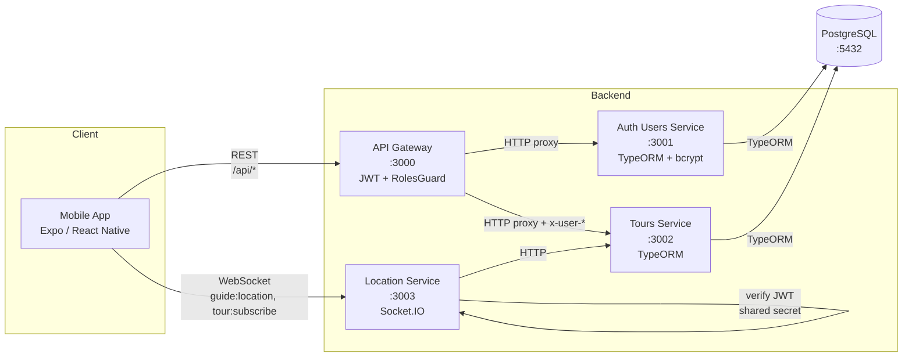
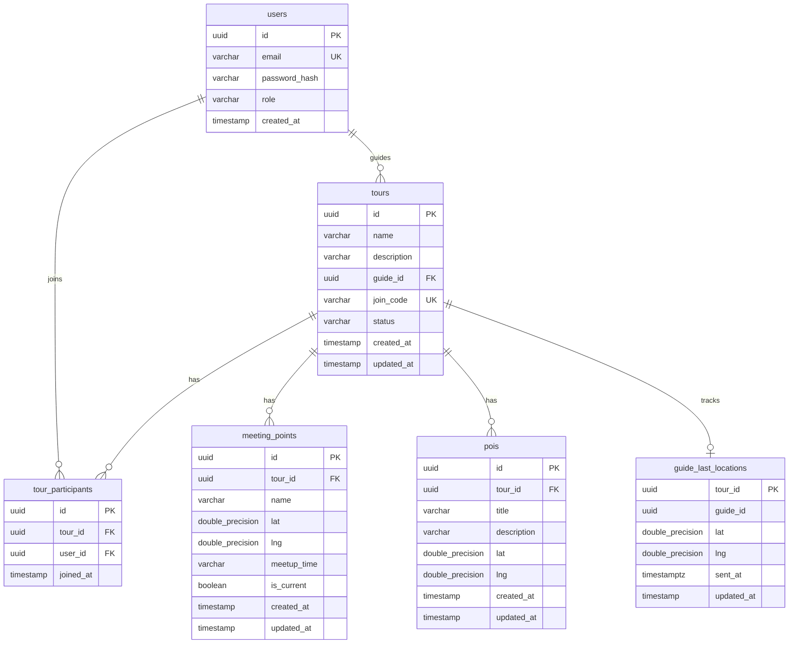

# GeoTour — Real-time Tour Tracking Platform

Platforma do udostępniania lokalizacji w czasie rzeczywistym dla przewodników turystycznych i ich grup, przygotowana na przedmiot **Zastosowania Informatyki w Gospodarce**.

## Cel projektu

GeoTour pozwala przewodnikom (`guide`) tworzyć wycieczki z unikalnym kodem dołączenia, transmitować swoją lokalizację GPS w czasie rzeczywistym oraz zarządzać punktami zbiórki i punktami zainteresowania (POI). Turyści (`tourist`) mogą dołączać do wycieczek przez kod, śledzić pozycję przewodnika na mapie i widzieć POI/punkty zbiórki.

Projekt prezentuje:

- **architekturę mikroserwisową** z bramą API (API Gateway) oraz osobnymi usługami uwierzytelniania, wycieczek i lokalizacji,
- komunikację **REST + WebSocket (Socket.IO)** pomiędzy klientem mobilnym a backendem,
- **uwierzytelnianie JWT** z rolami (`guide`/`tourist`) i mechanizmem `RolesGuard`,
- pracę z **PostgreSQL przez TypeORM** (relacje, indeksy, ograniczenia unikalności),
- aplikację mobilną w **React Native / Expo** z mapami Google,
- pełną konteneryzację stosu w **Docker Compose** oraz tryb developerski bez Dockera (Supabase/lokalny PostgreSQL).

## Technologie

| Warstwa        | Stack                                                                                |
| -------------- | ------------------------------------------------------------------------------------ |
| API Gateway    | NestJS 10, `@nestjs/axios`, Passport JWT, `class-validator`                          |
| Mikroserwisy   | NestJS 10, TypeORM 0.3, `class-validator`, `bcryptjs`                                |
| Realtime       | NestJS WebSockets, Socket.IO 4, `jsonwebtoken`                                       |
| Baza danych    | PostgreSQL 16 (Docker) lub Supabase (sesyjny pooler + SSL)                           |
| Mobile         | Expo 52, React Native 0.76, `react-native-maps`, `expo-location`, `socket.io-client` |
| Konteneryzacja | Docker, Docker Compose v2                                                            |
| Język          | TypeScript 5 (backend), JavaScript (mobile)                                          |
| Dev tools      | `ts-node-dev`, npm workspaces                                                        |

## Architektura systemu



### Odpowiedzialność serwisów

| Serwis                       | Rola                                                                                                            |
| ---------------------------- | --------------------------------------------------------------------------------------------------------------- |
| `backend/gateway`            | Pojedynczy punkt wejścia REST. Waliduje JWT, sprawdza role, przekierowuje żądania do mikroserwisów.             |
| `backend/auth-users-service` | Rejestracja, logowanie, zarządzanie kontami i hasłami (bcrypt). Wystawia tokeny JWT.                            |
| `backend/tours-service`      | CRUD wycieczek, uczestników, punktów zbiórki (`meeting_points`) i POI. Trwała ostatnia lokalizacja przewodnika. |
| `backend/location-service`   | WebSocket gateway dla strumienia lokalizacji w czasie rzeczywistym. Weryfikuje JWT lokalnie.                    |
| `backend/shared`             | Wspólne typy TS: `UserRole`, `JwtUserPayload`, `AuthTokenDto`.                                                  |
| `mobile`                     | Aplikacja Expo z ekranami: Auth, Home, Map, Manage, Settings.                                                   |

### Wzorce komunikacji

- **REST przez Gateway** — klient mobilny zawsze rozmawia z `:3000/api/*`. Gateway dokleja nagłówki `x-user-id` oraz `x-user-role` na podstawie zweryfikowanego JWT, dzięki czemu mikroserwisy wewnętrzne nie muszą ponownie parsować tokenu.
- **WebSocket bezpośrednio do `location-service`** — klient mobilny łączy się do `:3003` z tokenem JWT w `handshake.auth.token`. Location service weryfikuje token z tym samym `JWT_SECRET` co Gateway/Auth.
- **Walidacja dostępu do tury** — `location-service` przy każdej subskrypcji woła `tours-service` (`GET /api/tours/:id`), aby sprawdzić, czy użytkownik jest przewodnikiem lub uczestnikiem danej wycieczki.

## Struktura projektu

```
project/
├── backend/
│   ├── gateway/                          # API Gateway (NestJS, port 3000)
│   │   └── src/
│   │       ├── main.ts                   # Bootstrap, prefix /api, ValidationPipe, CORS
│   │       ├── app.module.ts             # ConfigModule, HttpModule, JwtModule
│   │       ├── controllers/
│   │       │   ├── auth-proxy.controller.ts   # /auth/register, /auth/login, /auth/me
│   │       │   └── tours-proxy.controller.ts  # /tours/*  (proxy + role guards)
│   │       ├── filters/
│   │       │   └── axios-proxy-exception.filter.ts  # Mapowanie błędów upstream
│   │       └── security/
│   │           ├── jwt.strategy.ts            # Passport JWT
│   │           ├── jwt-auth.guard.ts          # AuthGuard('jwt')
│   │           ├── roles.decorator.ts         # @Roles('guide' | 'tourist')
│   │           └── roles.guard.ts             # Reflector + ForbiddenException
│   ├── auth-users-service/               # Uwierzytelnianie (port 3001)
│   │   └── src/
│   │       ├── main.ts
│   │       ├── app.module.ts             # TypeORM, JwtModule
│   │       ├── auth/
│   │       │   ├── auth.controller.ts    # POST /auth/register, /auth/login
│   │       │   ├── auth.service.ts       # bcrypt hash + JWT issue
│   │       │   └── dto/{login,register}.dto.ts
│   │       └── users/user.entity.ts      # tabela `users`
│   ├── tours-service/                    # Domena wycieczek (port 3002)
│   │   └── src/
│   │       ├── main.ts
│   │       ├── app.module.ts             # TypeORM forFeature: tours, participants, mp, pois, guide_last_locations
│   │       ├── tours.controller.ts       # CRUD + state + meeting-points + pois + guide-location upsert
│   │       ├── tours.service.ts          # Logika domenowa, transakcje, generator joinCode
│   │       ├── tour.entity.ts            # status: 'planned'|'active'|'ended', joinCode UNIQUE
│   │       ├── tour-participant.entity.ts        # UNIQUE(tour_id, user_id)
│   │       ├── meeting-point.entity.ts           # isCurrent + composite index
│   │       ├── poi.entity.ts                     # POI z opisem
│   │       └── guide-last-location.entity.ts     # PK = tour_id (upsert)
│   ├── location-service/                 # Realtime (port 3003, Socket.IO)
│   │   └── src/
│   │       ├── main.ts
│   │       ├── app.module.ts
│   │       └── location.gateway.ts       # Wydarzenia: tour:subscribe, guide:location, tour:last-known:request
│   └── shared/                           # Wspólne typy TS
│       └── src/{auth.ts,index.ts}
├── mobile/                               # Expo / React Native
│   ├── App.js                            # Root + nawigacja stron
│   ├── app.config.js                     # Expo config (Google Maps API key z .env)
│   ├── context/AppContext.js             # Stan globalny: auth, tours, socket, tracking
│   ├── screens/
│   │   ├── AuthScreen.js                 # Logowanie / rejestracja (Tourist | Guide)
│   │   ├── HomeScreen.js                 # Lista tur, "Create Tour" / "Join Tour"
│   │   ├── MapScreen.js                  # Mapa, marker przewodnika, MP/POI
│   │   ├── MapScreen.web.js              # Wariant webowy
│   │   ├── ManageScreen.js               # (Guide) zarządzanie tour, MP, POI, status
│   │   ├── ManageScreen.web.js
│   │   └── SettingsScreen.js             # Edytowalne URL Gateway / Location WS
│   ├── components/                       # BottomNav, Toast, TourCard, PlaceSearchInput
│   └── theme.js                          # COLORS, SHADOWS
├── docker-compose.yml                    # postgres + 4 serwisy backend
├── .env / .env.example                   # Konfiguracja (DB, JWT, porty, URLs)
├── package.json                          # npm workspaces + skrypty start:*
├── TEST_CHECKLIST.md                     # Manualny checklist testowy (F1–F17)
└── README.md
```

## Model danych



> Schemat tworzony jest automatycznie przez TypeORM (`synchronize: true`) na podstawie encji w `auth-users-service` (`UserEntity`) i `tours-service` (pozostałe encje).

### Statusy biznesowe

| Pole                        | Wartości                       | Domyślne  |
| --------------------------- | ------------------------------ | --------- |
| `users.role`                | `guide`, `tourist`             | `tourist` |
| `tours.status`              | `planned`, `active`, `ended`   | `planned` |
| `meeting_points.is_current` | `true`/`false` (max 1 na tour) | `false`   |

### Ograniczenia bazodanowe

| Ograniczenie                                      | Cel                                                     |
| ------------------------------------------------- | ------------------------------------------------------- |
| `UNIQUE(users.email)`                             | Brak duplikatów kont                                    |
| `UNIQUE(tours.join_code)`                         | Każda tura ma globalnie unikalny kod dołączenia         |
| `UNIQUE(tour_participants.tour_id, user_id)`      | Użytkownik nie może dołączyć dwa razy do tej samej tury |
| `INDEX(tours.guide_id)`, `INDEX(tours.join_code)` | Szybki lookup po przewodniku i kodzie                   |
| `INDEX(meeting_points.tour_id, is_current)`       | Optymalizacja zapytania o aktualny punkt zbiórki        |
| `ON DELETE CASCADE` (uczestnicy, MP, POI)         | Spójność po usunięciu tury                              |

### Transakcje i spójność

W `tours-service` operacje wpływające na wiele wierszy korzystają z `dataSource.transaction(...)`:

- **Tworzenie/edycja punktu zbiórki z `isCurrent=true`** — najpierw `UPDATE meeting_points SET is_current = false WHERE tour_id = ?`, potem zapis nowego/edytowanego rekordu, atomowo. Dzięki temu w jednym czasie istnieje co najwyżej jeden „bieżący" punkt zbiórki na turę.
- **Generator `joinCode`** — pętla z `randomBytes(4).toString('hex')` + sprawdzenie `EXISTS`, do 5 prób, w razie kolizji rzuca `ConflictException`.
- **Upsert lokalizacji przewodnika** — `repository.upsert({...}, ['tourId'])` wykonuje atomowy `INSERT ... ON CONFLICT (tour_id) DO UPDATE`.

## Endpointy REST API (Gateway, prefix `/api`)

Wszystkie endpointy dostępne pod `http://localhost:3000/api`. Token JWT (`Authorization: Bearer …`) wymagany tam, gdzie zaznaczono. Walidacja DTO odbywa się przez `class-validator` (globalny `ValidationPipe` z `whitelist: true, transform: true`).

### Auth

| Metoda | Endpoint         | Opis                                      | Auth | Rola    |
| ------ | ---------------- | ----------------------------------------- | ---- | ------- |
| POST   | `/auth/register` | Rejestracja konta (email, password, role) | —    | —       |
| POST   | `/auth/login`    | Logowanie → `{ accessToken, user }`       | —    | —       |
| GET    | `/auth/me`       | Zwraca payload z aktualnego JWT           | JWT  | dowolna |

Domyślne ograniczenia: `email` walidowany przez `IsEmail`, `password` min. 6 znaków, `role` opcjonalna (`guide`/`tourist`, domyślnie `tourist`).

### Tours

| Metoda | Endpoint                  | Opis                                                     | Auth | Rola                     |
| ------ | ------------------------- | -------------------------------------------------------- | ---- | ------------------------ |
| POST   | `/tours`                  | Utwórz turę. Generuje unikalny `joinCode`                | JWT  | `guide`                  |
| GET    | `/tours/mine`             | Tury dla aktualnego użytkownika (jako guide lub tourist) | JWT  | dowolna                  |
| POST   | `/tours/join`             | Dołącz do tury kodem `joinCode`                          | JWT  | `tourist`                |
| GET    | `/tours/:id`              | Szczegóły tury (uczestnicy, MP, POI)                     | JWT  | guide tury lub uczestnik |
| GET    | `/tours/:id/participants` | Lista uczestników tury                                   | JWT  | guide tury lub uczestnik |
| PATCH  | `/tours/:id/state`        | Zmień status (`planned`/`active`/`ended`)                | JWT  | przypisany guide         |

### Meeting points (punkty zbiórki)

| Metoda | Endpoint                            | Opis                                                                       | Auth | Rola              |
| ------ | ----------------------------------- | -------------------------------------------------------------------------- | ---- | ----------------- |
| GET    | `/tours/:tourId/meeting-points`     | Lista punktów dla tury                                                     | JWT  | guide / uczestnik |
| POST   | `/tours/:tourId/meeting-points`     | Dodaj punkt (`name`, `lat`, `lng`, `meetupTime?`, `isCurrent?`)            | JWT  | przypisany guide  |
| PATCH  | `/tours/:tourId/meeting-points/:id` | Edycja punktu                                                              | JWT  | przypisany guide  |
| DELETE | `/tours/:tourId/meeting-points/:id` | Usuń punkt; jeśli był `isCurrent`, kolejny (najnowszy) staje się aktualnym | JWT  | przypisany guide  |

### POI (Points of Interest)

| Metoda | Endpoint                                        | Opis                                              | Auth | Rola              |
| ------ | ----------------------------------------------- | ------------------------------------------------- | ---- | ----------------- |
| GET    | `/tours/:tourId/pois`                           | Lista POI                                         | JWT  | guide / uczestnik |
| POST   | `/tours/:tourId/pois`                           | Dodaj POI (`title`, `description?`, `lat`, `lng`) | JWT  | przypisany guide  |
| PATCH  | `/tours/:tourId/pois/:id?clearDescription=true` | Edycja POI (flaga `clearDescription` zeruje opis) | JWT  | przypisany guide  |
| DELETE | `/tours/:tourId/pois/:id`                       | Usuń POI                                          | JWT  | przypisany guide  |

### Guide location (REST, używane wewnętrznie przez `location-service`)

| Metoda | Endpoint                        | Opis                                      |
| ------ | ------------------------------- | ----------------------------------------- |
| PUT    | `/tours/:tourId/guide-location` | Upsert ostatniej lokalizacji (utrwalanie) |
| GET    | `/tours/:tourId/guide-location` | Ostatnia zapisana lokalizacja (fallback)  |

### Health

| Metoda | Endpoint      | Opis                                                             |
| ------ | ------------- | ---------------------------------------------------------------- |
| GET    | `/api/health` | Każdy serwis ma swój `/api/health` zwracający `{ status: 'ok' }` |

## API WebSocket (Socket.IO, port 3003)

Klient łączy się do `ws://localhost:3003` z tokenem w `auth.token` (Socket.IO handshake). Po stronie serwera token jest weryfikowany lokalnie poprzez `jsonwebtoken.verify(token, JWT_SECRET)`.

### Eventy server → client

| Event                    | Payload                                             | Opis                                                            |
| ------------------------ | --------------------------------------------------- | --------------------------------------------------------------- |
| `connection:ready`       | `{ userId, role }`                                  | Połączenie uwierzytelnione poprawnie                            |
| `connection:error`       | `{ message }`                                       | Brak/błędny token, klient rozłączany                            |
| `tour:subscribed`        | `{ tourId }`                                        | Klient dołączył do pokoju `tour:<id>`                           |
| `tour:unsubscribed`      | `{ tourId }`                                        | Klient opuścił pokój                                            |
| `tour:error`             | `{ message }`                                       | Brak dostępu / walidacja                                        |
| `guide:location:update`  | `{ tourId, lat, lng, sentAt, guideId, isFallback }` | Bieżąca pozycja przewodnika; `isFallback=true` = z cache lub DB |
| `guide:location:missing` | `{ tourId }`                                        | Brak jakichkolwiek danych o pozycji                             |

### Eventy client → server

| Event                     | Payload                         | Wymagana rola              | Opis                                                                                   |
| ------------------------- | ------------------------------- | -------------------------- | -------------------------------------------------------------------------------------- |
| `tour:subscribe`          | `{ tourId }`                    | dowolna z dostępem do tury | Dołącza do pokoju, otrzymuje `tour:subscribed` + ostatnią pozycję                      |
| `tour:unsubscribe`        | `{ tourId }`                    | dowolna                    | Opuszcza pokój                                                                         |
| `tour:last-known:request` | `{ tourId }`                    | dowolna z dostępem         | Wymusza wysłanie ostatniej pozycji (cache → DB)                                        |
| `guide:location`          | `{ tourId, lat, lng, sentAt? }` | `guide` przypisany do tury | Publikuje pozycję; broadcastowane do całego pokoju, utrwalane w `guide_last_locations` |

### Walidacje

- `lat ∈ [-90, 90]`, `lng ∈ [-180, 180]` — sprawdzane przez `Number.isFinite` + zakres,
- dostęp do tury weryfikowany przez wywołanie `tours-service` (`GET /api/tours/:tourId`), z propagacją nagłówków `x-user-id`, `x-user-role` oraz `Authorization`,
- tylko właściciel tury (`tour.guideId === user.sub`) może publikować pozycję.

### Strategia odporności

- **Cache w pamięci** (`Map<tourId, LocationUpdateDto>`) trzyma ostatnią lokalizację — szybki fallback dla nowych subskrybentów.
- **Persistencja przez Tours Service** (`PUT /api/tours/:id/guide-location`) — po restarcie `location-service` lokalizacja jest odtwarzana z bazy z flagą `isFallback: true`.
- **Wskaźnik „stale"** po stronie klienta — jeżeli `Date.now() - lastUpdate > 10s`, marker przewodnika zmienia kolor na bursztynowy (zob. `AppContext.isGuideLocationStale`).
- **Reconnect Socket.IO** — klient ma `reconnectionAttempts: Infinity`, `reconnectionDelay: 1000–6000 ms`.

## Uwierzytelnianie i autoryzacja

### Przepływ JWT

1. `POST /api/auth/register` lub `/api/auth/login` → `auth-users-service` haszuje hasło `bcryptjs` (rounds = 10) i podpisuje JWT (`@nestjs/jwt`) z payloadem `{ sub, email, role }` oraz TTL z `JWT_EXPIRES_IN` (domyślnie `1d`).
2. Klient przechowuje `accessToken` (w aplikacji mobilnej trzymany w pamięci procesu — nie ma tu trwałego storage).
3. Każde żądanie REST do bramy zawiera `Authorization: Bearer <token>`. `JwtAuthGuard` (Passport) waliduje podpis przez `secretOrKey` z `JWT_SECRET`.
4. Bramka przekazuje żądanie do mikroserwisu, dodając nagłówki `x-user-id` i `x-user-role`. Mikroserwisy nie weryfikują JWT ponownie, ale ufają nagłówkom (założenie: usługi wewnętrzne nie są wystawione publicznie).
5. WebSocket Gateway w `location-service` weryfikuje JWT samodzielnie (lokalny `jsonwebtoken.verify`) — kanał WS nie przechodzi przez bramę.

### Kontrola ról

Adnotacja `@Roles('guide')` + `RolesGuard` (Reflector + `ForbiddenException`):

```typescript
@Post()
@UseGuards(JwtAuthGuard, RolesGuard)
@Roles('guide')
async createTour(@Req() req, @Body() body) { ... }
```

W warstwie `tours-service` dodatkowo każda mutacja sprawdza, czy `tour.guideId === userId` (zasada „tylko przypisany przewodnik zarządza swoją trasą").

## Konfiguracja środowiska

Plik `.env` w katalogu głównym (oraz drugi `.env` w katalogu serwisu, jeśli skrypt jest uruchamiany lokalnie). Każdy serwis ładuje `.env` z `process.cwd()` oraz fallbackowo `../../.env` (monorepo root).

| Zmienna                 | Opis                                                              | Przykład                                                       |
| ----------------------- | ----------------------------------------------------------------- | -------------------------------------------------------------- |
| `NODE_ENV`              | `development` / `production`                                      | `development`                                                  |
| `JWT_SECRET`            | Sekret HMAC dla podpisu JWT — **ten sam dla wszystkich serwisów** | `super-secret-change-me`                                       |
| `JWT_EXPIRES_IN`        | TTL tokenu                                                        | `1d`                                                           |
| `POSTGRES_HOST`         | Host bazy                                                         | `postgres` (Docker) / `aws-1-eu-central-1.pooler.supabase.com` |
| `POSTGRES_PORT`         | Port bazy                                                         | `5432` / `6543`                                                |
| `POSTGRES_USER`         | Użytkownik                                                        | `postgres` lub `postgres.<ref>`                                |
| `POSTGRES_PASSWORD`     | Hasło                                                             | `postgres`                                                     |
| `POSTGRES_DB`           | Nazwa bazy                                                        | `geoplatform` / `postgres`                                     |
| `POSTGRES_SSL`          | `true` dla Supabase / produkcji, `false` dla lokalnego Dockera    | `false`                                                        |
| `AUTH_SERVICE_PORT`     | Port `auth-users-service`                                         | `3001`                                                         |
| `TOURS_SERVICE_PORT`    | Port `tours-service`                                              | `3002`                                                         |
| `LOCATION_SERVICE_PORT` | Port `location-service`                                           | `3003`                                                         |
| `GATEWAY_PORT`          | Port API Gateway                                                  | `3000`                                                         |
| `AUTH_SERVICE_URL`      | URL używany przez Gateway / Location service                      | `http://auth-users-service:3001`                               |
| `TOURS_SERVICE_URL`     | URL używany przez Gateway i `location-service`                    | `http://tours-service:3002`                                    |
| `LOCATION_SERVICE_URL`  | URL używany przez aplikację mobilną do WS                         | `http://localhost:3003`                                        |
| `API_KEY`               | Google Maps API Key (wstrzykiwany do `app.config.js` Expo)        | `AIza...`                                                      |

> Plik `.env.example` zawiera komplet zmiennych z domyślnymi wartościami pasującymi do `docker-compose.yml`.

## Uruchomienie lokalne

### Wymagania

- **Node.js 20+** (ze względu na `@nestjs/typeorm` 10 i `ts-node-dev`),
- **npm 10+** (workspaces),
- **Docker Desktop** (dla wariantu z kontenerami) lub PostgreSQL 14+ albo darmowe konto **Supabase**,
- **Android Studio Emulator** lub urządzenie fizyczne z Expo Go (dla aplikacji mobilnej),
- klucz **Google Maps Android API** (do `API_KEY` w `.env`).

### Wariant A — pełny stos w Dockerze

```bash
# 1. Sklonuj repo i wejdź do katalogu
cd project

# 2. Skopiuj zmienne środowiskowe
copy .env.example .env

# 3. Zbuduj i uruchom serwisy + bazę
docker compose up --build
```

To uruchomi: `postgres` (5432), `auth-users-service` (3001), `tours-service` (3002), `location-service` (3003), `gateway` (3000). Schemat bazy jest tworzony automatycznie przez TypeORM `synchronize: true` przy pierwszym starcie.

### Wariant B — bez Dockera (Supabase lub lokalny PostgreSQL)

```bash
# 1. Zainstaluj zależności (npm workspaces)
npm install

# 2. W .env ustaw POSTGRES_* (np. Supabase session pooler) i POSTGRES_SSL=true
#    oraz lokalne URL serwisów:
#       AUTH_SERVICE_URL=http://localhost:3001
#       TOURS_SERVICE_URL=http://localhost:3002
#       LOCATION_SERVICE_URL=http://localhost:3003

# 3. Uruchom każdy serwis w osobnym terminalu
npm run start:auth
npm run start:tours
npm run start:location
npm run start:gateway
```

### Skrypty npm (root)

| Skrypt           | Polecenie                                         |
| ---------------- | ------------------------------------------------- |
| `start:gateway`  | `npm run -w backend/gateway start:dev`            |
| `start:auth`     | `npm run -w backend/auth-users-service start:dev` |
| `start:tours`    | `npm run -w backend/tours-service start:dev`      |
| `start:location` | `npm run -w backend/location-service start:dev`   |
| `start:mobile`   | `npm run start -w mobile -- --android`            |
| `build`          | `npm run build --workspaces --if-present`         |
| `lint`           | `npm run lint --workspaces --if-present`          |

Każdy serwis ma własny `start:dev` oparty o `ts-node-dev --respawn --transpile-only` (gorące przeładowanie).

### Aplikacja mobilna (Expo)

```bash
# 1. Upewnij się, że backend działa (Docker lub lokalnie)
# 2. Wejdź do mobile/
cd mobile

# 3. Uruchom Metro bundler
npx expo start --android   # lub --ios, --web
```

Po starcie:

- **Emulator Android**: domyślny Gateway URL = `http://10.0.2.2:3000`, WS = `http://10.0.2.2:3003`,
- **Symulator iOS / Web**: `http://localhost:3000` i `http://localhost:3003`,
- URL można nadpisać w ekranie **Settings** w aplikacji.

Po uruchomieniu należy zarejestrować dwa konta (jedno `guide`, jedno `tourist`) — przewodnik tworzy turę, turysta dołącza kodem widocznym w karcie tury.

## Mapa scenariuszy aplikacji mobilnej

| Scenariusz                      | Ekran            | Rola    | Opis                                                                |
| ------------------------------- | ---------------- | ------- | ------------------------------------------------------------------- |
| Rejestracja / Logowanie         | `AuthScreen`     | —       | Formularz email/hasło + selektor roli (tylko przy rejestracji)      |
| Lista tur i wybór               | `HomeScreen`     | dowolna | Karty tur ze statusem; przyciski „Create Tour" / „Join Tour"        |
| Tworzenie tury                  | `HomeScreen`     | guide   | Formularz nazwy + opisu; po utworzeniu tour wybierany automatycznie |
| Dołączanie do tury kodem        | `HomeScreen`     | tourist | Wpisanie 8-znakowego kodu (np. `A1B2C3D4`)                          |
| Zmiana statusu tury             | `ManageScreen`   | guide   | Chip „Active" / „Ended"                                             |
| Dodawanie/edycja punktu zbiórki | `ManageScreen`   | guide   | Formularz + mini-mapa do wyboru lat/lng                             |
| Dodawanie/edycja POI            | `ManageScreen`   | guide   | Tytuł, opis, lat/lng                                                |
| Live tracking pozycji           | `MapScreen`      | guide   | „Start Tracking" → emitowanie lokalizacji co 2 s przez Socket.IO    |
| Śledzenie przewodnika           | `MapScreen`      | tourist | Marker przewodnika (zielony = świeży, bursztynowy = ≥10 s stale)    |
| Konfiguracja URL backendu       | `SettingsScreen` | dowolna | Edytowalne `gatewayUrl` i `locationWsUrl`                           |

## Walidacja danych wejściowych

Wszystkie DTO w bramie i mikroserwisach używają `class-validator` z globalnym `ValidationPipe`:

| DTO                             | Pola i reguły                                                                           |
| ------------------------------- | --------------------------------------------------------------------------------------- |
| `RegisterDto`                   | `email` (`IsEmail`), `password` (`MinLength(6)`), `role?` (`IsIn(['guide','tourist'])`) |
| `LoginDto`                      | `email`, `password (≥6)`                                                                |
| `CreateTourDto`                 | `name (≥2)`, `description?`                                                             |
| `JoinByCodeDto`                 | `joinCode (≥4)`                                                                         |
| `ChangeTourStateDto`            | `status ∈ {planned, active, ended}`                                                     |
| `Create/Update MeetingPointDto` | `name (≥2)`, `lat ∈ [-90,90]`, `lng ∈ [-180,180]`, `meetupTime?`, `isCurrent?`          |
| `Create/Update PoiDto`          | `title (≥2)`, `description?`, `lat`, `lng`                                              |

`whitelist: true` automatycznie usuwa właściwości niezdefiniowane w DTO; `transform: true` rzutuje stringi z querystring na typy DTO.

## Obsługa błędów Gateway

Filtr `AxiosProxyExceptionFilter` (`@Catch(AxiosError)`) propaguje status HTTP i ciało odpowiedzi z mikroserwisu do klienta. Jeśli upstream nie odpowiada, klient otrzymuje `502 Bad Gateway` z komunikatem.

Mikroserwisy używają standardowych wyjątków NestJS:

| Wyjątek                 | Mapowanie HTTP | Przykład użycia                                          |
| ----------------------- | -------------- | -------------------------------------------------------- |
| `BadRequestException`   | 400            | Brak `tourId`, niepoprawna data                          |
| `UnauthorizedException` | 401            | `Invalid credentials` w `auth.service.ts`                |
| `ForbiddenException`    | 403            | Brak roli, próba edycji cudzej tury                      |
| `NotFoundException`     | 404            | Nieznane `tourId`, `joinCode`, MP, POI                   |
| `ConflictException`     | 409            | Email zajęty, użytkownik już w turze, kolizja `joinCode` |

## Zabezpieczenia i dobre praktyki

- **bcryptjs** (rounds = 10) do hashowania haseł.
- **JWT** podpisywany sekretem z `JWT_SECRET` (HS256), TTL z `JWT_EXPIRES_IN`.
- **Tylko sekret** — klucze i hasła trzymane w `.env` poza repozytorium (`.gitignore` zawiera `.env`).
- **CORS** włączony w bramie (`app.enableCors()`); WebSocket gateway ma `cors.origin: '*'` (do zacieśnienia w produkcji).
- **`whitelist: true`** w `ValidationPipe` blokuje przesycenie nieoczekiwanymi polami.
- **Walidacja koordynat** dwustopniowa: `class-validator` + sprawdzanie `Number.isFinite` w `location.gateway`.
- **`onDelete: CASCADE`** dla powiązanych encji (uczestnicy, MP, POI) — usunięcie tury sprząta dane zależne.

## Obraz Dockera i deploy

Każdy serwis ma własny `Dockerfile`. `docker-compose.yml` orkiestruje cały stos i wstrzykuje `.env`. Wolumin `pgdata` zachowuje dane PostgreSQL między restartami kontenera.

```bash
# Pełen rebuild
docker compose down -v
docker compose up --build

# Logi pojedynczego serwisu
docker compose logs -f gateway
docker compose logs -f tours-service
```

## Testy manualne

Pełen scenariusz testowy w pliku `TEST_CHECKLIST.md` (F1–F17 + sekcje przekrojowe), pokrywa m.in.:

- F1/F9 — rejestracja + logowanie obu ról,
- F2–F4 — tworzenie tury, lista tur, zmiana statusu,
- F5 — live tracking przewodnika z emitowaniem co 2 s,
- F6/F7 — meeting points i POI z mini-mapą do wyboru współrzędnych,
- F10–F13 — dołączanie kodem i widok tury z perspektywy turysty,
- testy odporności: stale indicator po 10 s, fallback po restarcie `location-service`, czyszczenie po przełączeniu tury.

## Licencja i autorzy

Projekt edukacyjny, semestr 8 — Politechnika, kierunek Informatyka, przedmiot **Zastosowania Informatyki w Gospodarce**. Repozytorium prywatne (`"private": true` w `package.json`).
